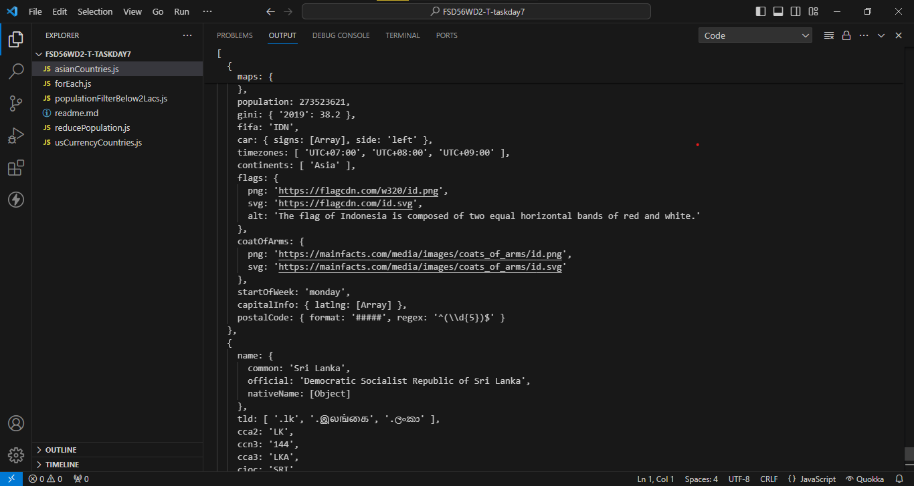
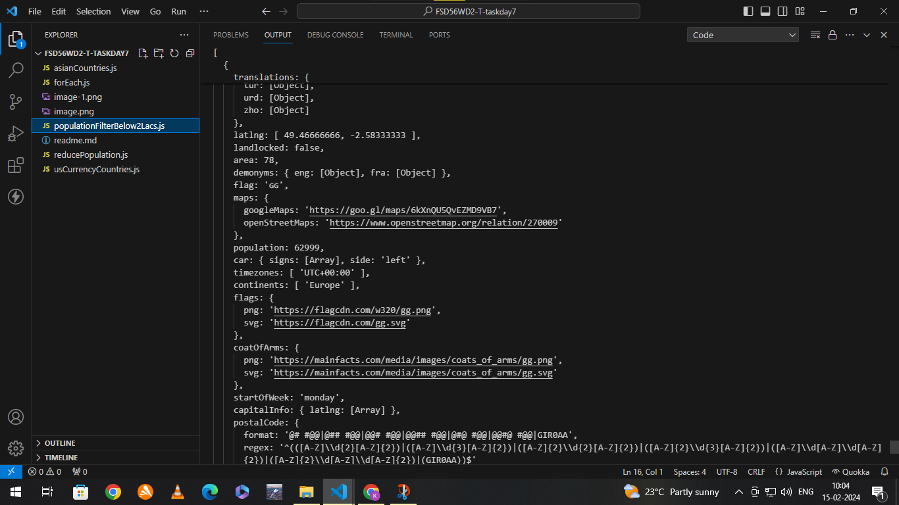
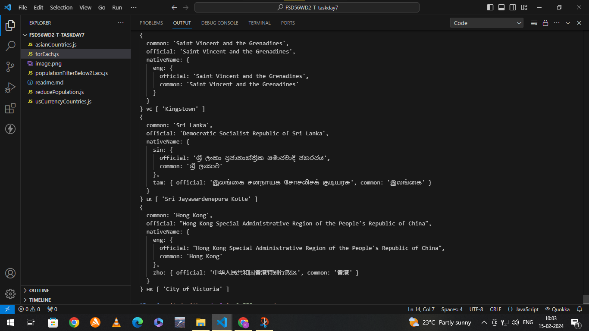
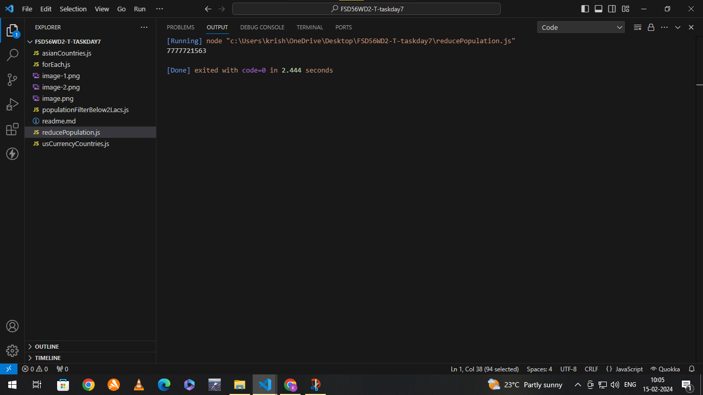
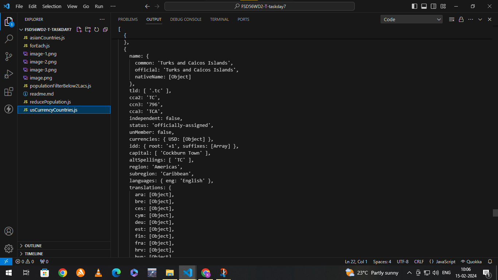

This repository consists of solutions for the task Day-7.
task details are given below.

# Task Description

this task was based on the topics of array functions like map,reduce and filter.

the link that we were given to finish this task was **Rest Countries APi** Url and the questions are below under the name of **Sub - tasks**

API Endpoint : https://restcountries.com/v3.1/all   
Library : XHR2   
Environment : nodeJS

# Sub - Task - 1
1. Get all the countries from Asia continent /region using Filter function.

the answer for this question is in the **asianCountries.js** file.   
The required solution was fulfilled.The screenshot is attached below for reference.

# Sub - Task - 2
2. Get all the countries with a population of less than 2 lakhs using Filter function

the answer for this question is in the **populationFilterBelow2Lacs.js** file.   
The required solution was fulfilled.The screenshot is attached below for reference. 

# Sub - Task - 3
3. Print the following details name, capital, flag, using forEach function

the answer for this question is in the **forEach.js** file.   
The required solution was fulfilled.The screenshot is attached below for reference. 

# Sub - Task - 4
4. Print the total population of countries using reduce function

the answer for this question is in the **reducePopulation.js** file.   
The required solution was fulfilled.The screenshot is attached below for reference. 

# Sub - Task - 5
5. Print the country that uses US dollars as currency.

the answer for this question is in the **usCurrencyCountries.js** file.   
The required solution was fulfilled.The screenshot is attached below for reference. 

